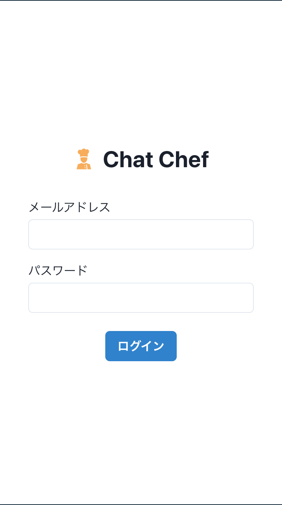
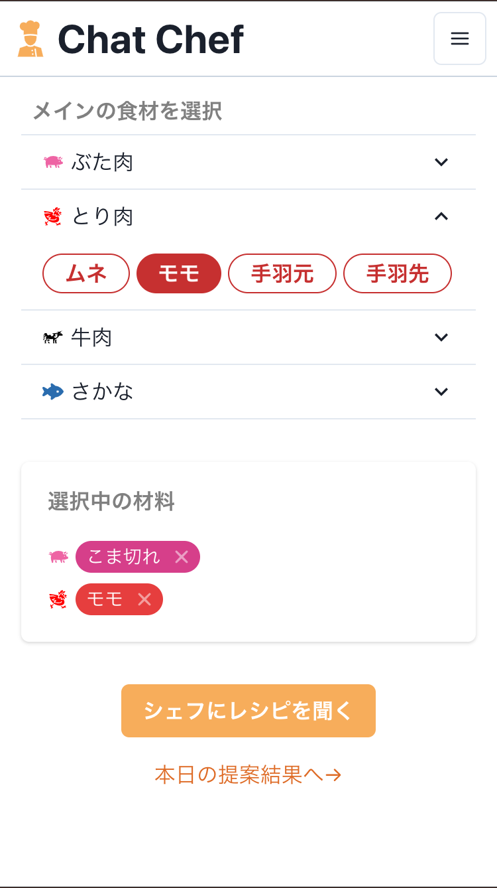
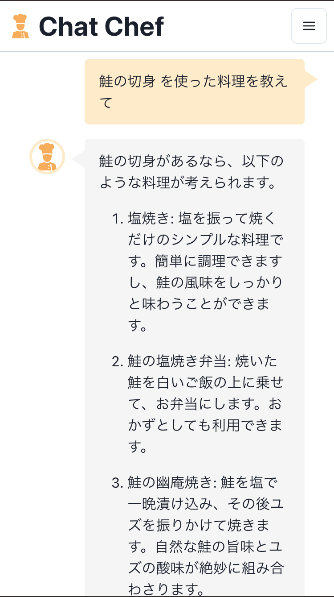
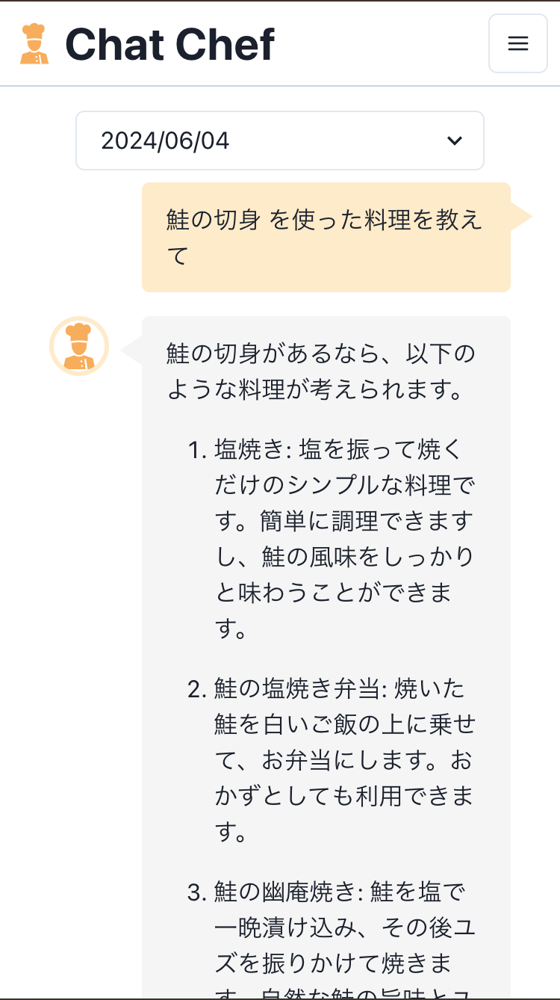

# Chat Chef

## アプリの概要

食材を選択し、その食材を用いた料理を提案してくれるアプリ

デモ用アカウント（シェフに料理は聞けません）
|メールアドレス|パスワード|
|:--|:--|
|not-admin@example.com|Passw0rd!|

### 開発環境

|       | version |
| :---- | :------ |
| node  | 18.17.1 |
| vite  | 4.4.5   |
| react | 18.2.0  |

### 主な使用ライブラリやAPI

|                 | 説明                                           |
| :-------------- | :--------------------------------------------- |
| Redux toolkit   | 状態管理ツール                                 |
| ChakraUI        | UIライブラリ                                   |
| ChatGPT API     | 料理の提案に使用                               |
| Firebase        | ログイン認証                                   |
| FireStore       | 料理の提案結果を保存                           |
| CloudFunctions  | ChatGPT APIを実行し、FireStoreに結果を保存する |
| vite-plugin-pwa | PWAに対応させるためのツール                    |

その他にも静的解析ツール(ESLintやStyleLint)なども導入しています。

## 画面一覧

| ログイン画面                          | 食材選択画面                                |
| :------------------------------------ | :------------------------------------------ |
|    |          |
| 料理の提案画面                        | 過去の提案の履歴画面                        |
|  |  |

## デプロイメモ

追加機能を実装した場合はPRを作成し、Netlifyで正常に動くか確認すること

1. `$ npm run build`でビルドファイルを作成
2. `$ firebase deploy`でデプロイ完了
