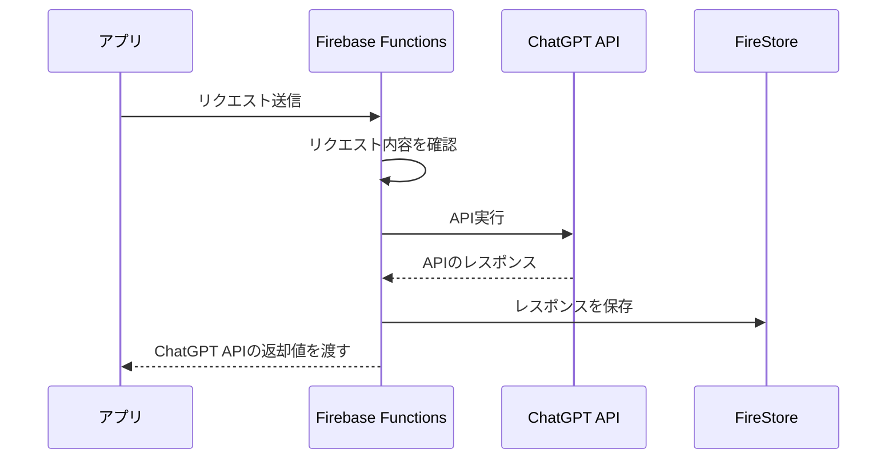

# Chat Chef

食材を選択し、選択した食材を用いた料理をシェフ（ChatGPT）から提案してもらうアプリケーションです。

## なぜつくったのか

> 彼女「今日何食べたい？」
>
> 私「なんでもいい」
>
> 彼女「🤬」

を解決するために作りました。
選択できる食材はよくうちの冷蔵庫に入っている食品です。

## 機能

### 選択した食材を用いた料理をシェフ（ChatGPT）から提案してもらう機能

アプリからFirebase Functionsを呼び出し、Firebase FunctionsからChatGPT APIを実行しています。その結果をアプリへ返却しています。
その際、ChatGPT APIの返却値を再利用するためにFireStoreへ保存しています。

シーケンス図は以下の通り

画面側からChatGPT APIを呼び出すとAPIの結果を待たずに処理の中断が発生する可能性(ユーザーによる画面リロードなど)があります。ChatGPT APIの実行を無駄にしたくないため、FunctionsでChatGPT APIを呼び出しています。

### ログイン機能

Firebase Authenticationを利用してログイン認証を実装しています。
ChatGPT APIは有料であり、不正な呼び出しを避けるため、ログイン認証を行い、管理者権限を持つユーザーのみAPIを実行できるようにしています。

 |

### 本日の料理提案画面

シェフ（ChatGPT）から提案してもらった料理を確認する画面です。
チャットアプリでシェフとトークしているようなデザインにしています。
1日に複数回ChatGPT APIを実行できるため、ページャー機能もあります。

### 過去の提案の履歴

ChatGPT APIの処理に時間がかかってしまうため、過去の提案履歴から食べたい料理をさっと確認するための機能です。
この画面と本日の料理提案画面で用いているコンポーネントは共通化するように工夫しています。

### 接続情報

本番環境のURL

https://chat-chef-5fe12.web.app/

デモ用アカウント（シェフに料理は聞けません）
|メールアドレス|パスワード|
|:--|:--|
|not-admin@example.com|Passw0rd!|

## 使用技術

### 開発環境

|       | version |
| :---- | :------ |
| node  | 18.17.1 |
| vite  | 4.4.5   |
| react | 18.2.0  |

### 主な使用ライブラリやAPI、ツール

|                 | 説明                                           |
| :-------------- | :--------------------------------------------- |
| Redux toolkit   | 状態管理ツール                                 |
| ChakraUI        | UIライブラリ                                   |
| ChatGPT API     | 料理の提案に使用                               |
| Firebase        | ログイン認証やホスティング、Functionsに利用    |
| FireStore       | 料理の提案結果を保存                           |
| CloudFunctions  | ChatGPT APIを実行し、FireStoreに結果を保存する |
| vite-plugin-pwa | PWAに対応させるためのツール                    |
| netlify         | CI/CD                                          |

その他にも静的解析ツール(ESLintやStyleLint)なども導入しています。

## デプロイメモ

追加機能を実装した場合はPRを作成し、Netlifyで正常に動くか確認すること

1. Netlifyで確認できたら、PRをマージ
2. `$ firebase deploy`でデプロイ実施
